# Statistics

The statistics features of OJS allow you to view different numbers pertaining to the activity, access, and downloads of various aspects of your site, including article and abstract views, subscription activity, editorial and review activity, and user counts separate by role. There is also a Report Generator section for producing various reports from some of the available data.

This section will describe the statistics report/visualization tools available in OJS and how to use them. If you are interested in how to manage statistics as a systems administrator, including configuring the statistics framework, managing legacy statistics and statistics in OJS 2, and troubleshooting statistics, please view [the PKP Administrator’s Guide’s documentation on statistics](https://docs.pkp.sfu.ca/admin-guide/en/statistics).

For a video walkthrough of Statistics in OJS, see our [Setting up a journal in OJS 3.3. Module 13: Statistics
](https://www.youtube.com/watch?v=fU1orCK7GSM&list=PLg358gdRUrDVTXpuGXiMgETgnIouWoWaY) video below.

## Definitions

The following definitions may be helpful to you for understanding the variety of statistics tracked by OJS.

* **Abstract page:** the landing page for an article, containing the title, author information, abstract, DOI, and links to any article full-text galleys.  Also known as the “article page” or “landing page.” This page is normally used as the point of record for the article for DOIs or other hyperlinks: Crossref DOIs resolve to article abstract pages, as opposed to galley files, for example, as would most other indexing services.
* **Article view:** within the statistics framework, any reference to an “article view” means a single unique view of the article abstract page by a visitor. This is not an aggregate count of all article and galley views - it refers to abstract views only.
* **Galley view:** within the statistics framework, any reference to a “galley view” means a single unique view or download of the a specific galley file by a visitor. Also known as a “galley download.” This is not an aggregate count of all galley views - if there are multiple galleys for an article \(e.g., an HTML file, a PDF file, etc.\), each will have its own unique galley view count. OJS does not distinguish between galley downloads and views in the metrics table; downloads are counted as galley views.
* **Multi-clicks:** the process \(accidental or nefarious\) of increasing usage counts by clicking on an abstract page or galley file multiple times in quick succession. OJS identifies and removes these attempts from its usage metrics, as per the Project COUNTER Code of Practice.
* **Project COUNTER Code of Practice:** a set of practices developed by COUNTER to establish a means to report on usage metrics for electronic resources in a consistent way. The Code provides rules on what should be counted as a view, including specific rules for robot usage and multi-click abuse. OJS filters metrics through these rules. It should also be noted that PKP is part of the COUNTER Bots and Crawlers Working Group.
* **Robots, crawlers, bots:** nonhuman site visitors who may still view and download article data. These are usually identified as such to the server, and OJS does not count them in its usage metrics, as per the Project COUNTER Code of Practice.

## Articles

OJS offers Editors and Journal Managers the option of viewing graph and table representations of article usage, including abstract views and full-text downloads.

The visual statistics can be found under Statistics on the left menu panel, by clicking Articles.

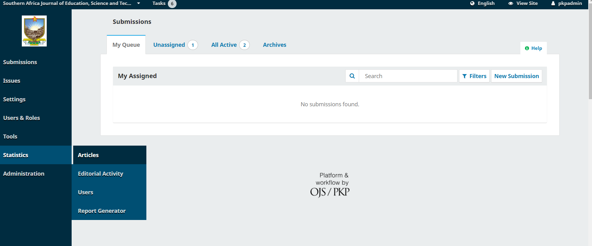

The Articles statistics show the articles’ abstract views in both graph and table format. The visual graphic can be changed to Monthly or Daily view. The table format will allow you to filter the Total in ascending or descending order.

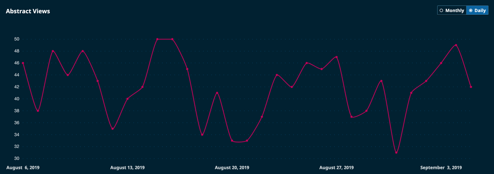

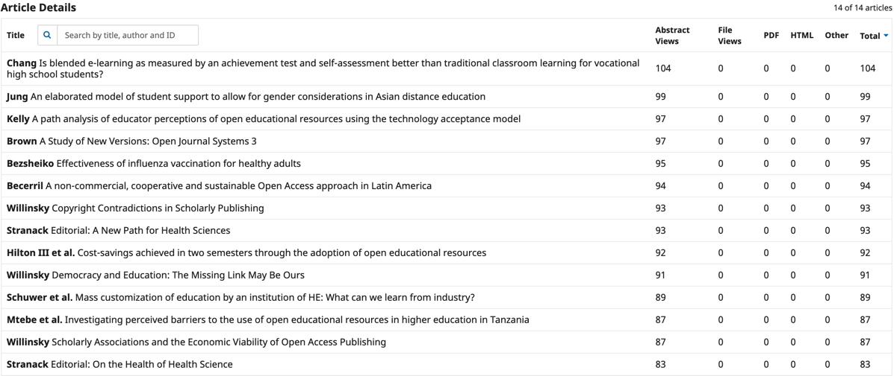

The calendar icon on the top right corner of your dashboard gives you the option of changing the article view to the Last 30 days, Last 90 days, Last 12 months, All dates, or a Custom Date Range.

The filter icon on the top right corner of your dashboard gives you the option of filtering the articles by Sections.

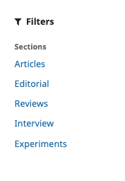

You also have the option of searching the statistics of a specific article by title, author, or manuscript ID by using the search function under Article Details.

## Editorial Activity

This section provides statistics about the editorial workflow, such as number of submissions received, days to first editorial decision, and acceptance and rejection rates. You can filter these statistics using a custom date range to, e.g., find the number of articles accepted during a 12-month period.

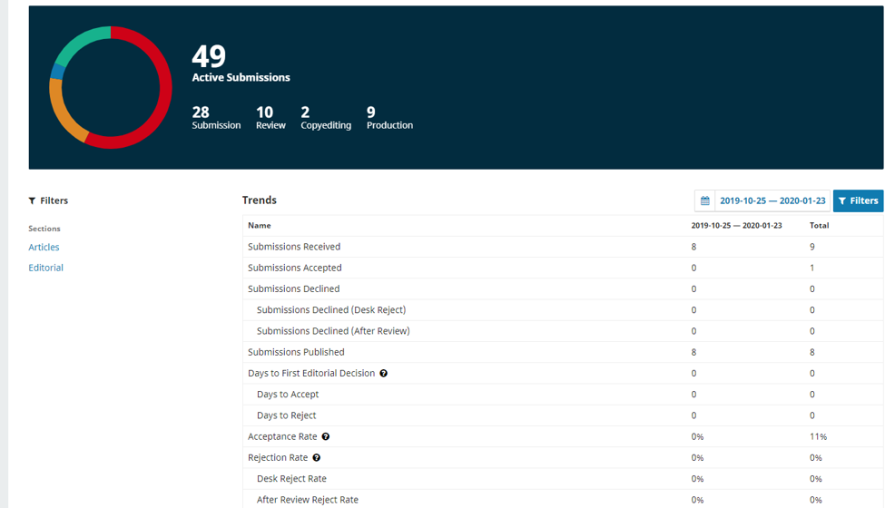

There are some important things to note when considering the data in these reports:

* Published submissions within a date range only count the initial publication date and not subsequent versions.
* Days to decision uses an 80% threshold, so the data listed represent that 80% of submissions with a decision have received one within X number of days.
* The acceptance and decline rates only count submissions that have received an accept/decline decision, so they exclude submissions still in the queue.
* If a date range is applied, it only counts submissions that were submitted AND accepted/declined within that date range. So, e.g., a submission that was submitted before the date range but received an accept/reject decision within the date range will not be counted. For this reason, it's best to use long date ranges and older date ranges to get accurate acceptance/rejection rates.

An Editorial Activity Report will be generated monthly and can be sent by email to editors and section editors. All managers and section editors are automatically opted out of the monthly report; however, you can opt in by going to User Profile > Notifications and unchecking the box that disables the automated email.

## Users

This section provides information about new user/role registrations within a specified time period. The Total column is not a total number of accounts created; it identifies how many users have that role in the system right now. When an existing user receives a new role, such as a registered author becoming a reviewer, that addition to the total number of reviewers in the system will be reflected in the data by an increase in the number of reviewers but no change in the total number of users.

## Report Generator

The Report Generator page provides access to a variety of reports from your journal.

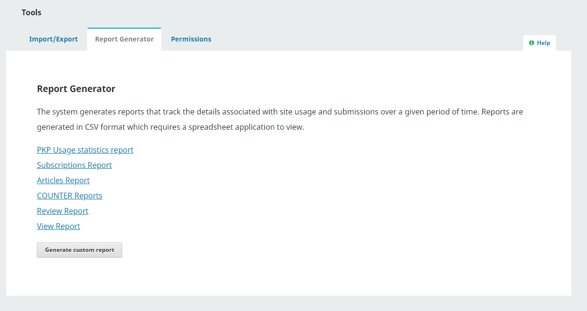

The system generates reports that track the details associated with site usage and submissions over a given period of time. These reports can be broadly grouped into “usage” reports that contain usage metrics indicative of visitor readership and “content” reports that provide data on the respective item (eg. review information). Reports are generated in CSV format which requires a spreadsheet application to view. 

* PKP Usage Statistics Report: Provides granular daily usage metrics for all article, article file, issue and homepage views/downloads. Will include visitor country data, if that is being logged. See Usage Statistics Report below for more information and examples. (Usage)
* Subscriptions Report: Provides information on any individual and institutional subscriptions. This report option is only available if subscriptions are enabled on the journal. (Content)
* Articles Report: Provides a spreadsheet of all published articles. (Content)
* COUNTER Reports: Provides COUNTER reports for all journals on the OJS application. Provides monthly and year to date aggregate counts for abstract and galley views. (Usage)
* Review Report: Provides review information on all articles in the system, including reviewer names, reviews, and recommendations. (Content)
* View Report: Provides a report on galley and abstract views by readers (i.e., how many times a PDF for an article has been viewed). (Usage)
* Custom Report Generation: Customizable version of the Usage Statistics report, where various facets can be selected and specific date spans can be set. See Generate Custom Report for more information and examples. (Usage)

### Usage Statistics Report

This report provides granular data on monthly views for the journal homepage, issue TOCs, article abstract/landing pages, and file views in CSV format. It provides country information (if configured). Each row provides a total monthly view count for a particular object (journal home page, article abstract page, article galley, or issue table of contents). It further facets this by country if country support has been enabled and properly configured.

**Use for:** generating a multifaceted overview content usage from month to month. It lists monthly view counts for all articles, article file downloads, issue TOC views, and journal homepage views for the specified timespan. Additional manual manipulation of the resulting report must be done to achieve aggregate results.

**Do Not Use for:** attempting to get a quick usage snapshot, legacy usage, or journals that have a very large metrics dataset \(due to long history, high readership, or depth of metrics granularity\). Use the Custom Report Generator instead.

**Special Notes:**

* This report attempts to capture the entire usage history for: the journal home page, all article abstracts, all article galleys, and all issue table of contents.
* **OJS version 3.1.1 or older installs**: To reduce the potential for exceeding time limits for downloads, this report only provides 5,000 records. If you have a lot of reportable data, this report will most likely not report it all. If this is the case, the Custom Report Generator plugin should be used instead, using smaller date ranges. (This restriction was removed in OJS 3.1.2.)

**Example Data \(slightly edited for clarity\):**

| **ID** | **Type** | **Title** | **Issue** | **Journal** | **Country** | **Month** | **Count** |
| --- | --- | --- | --- |
| 1 | Journal | Canadian Journal of Communication | CJC | CA | 201502 | 1678 |  |
| 112 | Article | Toronto Star Fires Reporter Claire Hoy, Sues Him and TV Stations on Libel Charge | Vol 1, No 3 \(1974\) | CJC | CA | 201502 | 3 |
| 112 | Article | Toronto Star Fires Reporter Claire Hoy, Sues Him and TV Stations on Libel Charge | Vol 1, No 3 \(1974\) | CJC | US | 201502 | 1 |

From the above example, we can see that in February 2015 the main CJC journal homepage was viewed 1,678 times, which the article “Toronto Star Fires Reporter …” was viewed 3 times from Canada and once from the United States.

### View Report

This report provides per-article abstract views and galley views/downloads. These usage metrics are not filtered for multi-clicks or bot/crawler activity and thus may seem inflated in comparison to more recent statistics.

Example Data (slightly edited for clarity):

In the sample below we can see that article 95, “The Making of the Canadian Media,” has had 443 abstract views and 1476 total galley views. The PDF and Total Galley views are the same because there were no HTML views. With article 1125, “Digital Networks,” the abstract was viewed 1821 times and total galley views are 8478, which is the sum of the HTML and PDF views.

****

| **ID** | **Article Title** | **Issue** | **Date Published** | **Abstract** | **Total Galleys** | **HTML** | **PDF** |
| --- | --- | --- |
| 95 | The Making of the Canadian Media | Vol 6, No 1 \(1979\) | 1979-01-03 | 443 | 1476 |   | 1476 |
| 1125 | Digital Networks | Vol 24, No 4 \(1999\) | 1999-04-01 | 1821 | 8478 | 2093 | 6385 |

### Generate Custom Report

Use this feature to build your own reports. These reports provide granular data on daily views for the journal using the full metrics dataset. You are able to aggregate results by:

* Country
* Region
* City
* Month
* Day

Metrics are tracked against specific item types (AKA “objects”):

* File downloads
* Abstract views
* Issue Table of Contents views
* Journal Homepage views

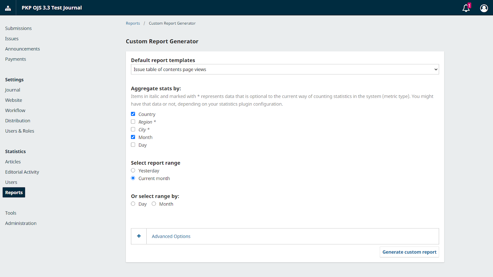

You are also able to limit results to specific date spans.

This is the most flexible report option available in OJS and can provide a very detailed amount of data. Below are some examples of statistics questions that may be useful to journals, as well as instructions on how to formulate a report to answer those questions using this feature.

Special Notes on the Report Generator:

* Depending on the amount of data in your system, the facets you choose to retrieve, and the date span you choose, the system may fail to completely generate a report without timing out. If you encounter this, try reducing the requested date span.
* If you generate a custom report, the report will also provide you with a Report URL that you can save to use to repeat the identical report process. Make sure to copy and save the URL somewhere so that you can re-run your search later (it will disappear once the page is reloaded).
* If you create a report that reports on “yesterday” or “current month,” the resulting Report URL will always use “yesterday” or the “current month” relative to the day you run it. So if you originally created a report to report on “yesterday” a year ago and then ran it today, it would report on yesterday. However, if you specify a specific date range, say April 1 - April 15 2018, the resulting Report URL will always report metrics for that specific range.
* Note that the current day’s data will not be available until the next day.
* The generator works like a funnel for data. The trick is to narrow down the bigger elements (such as date range), select what you’re interested in from there (issues, articles, etc.), then tweak the data at the end (i.e., sort by number of downloads).
* The Report Generator is most useful if you use the Advanced Options. All the examples below make use of the advanced options.

#### Example report: How well has a particular (i.e., most recent) issue performed over the last few months?

This particular query will give you a monthly count of how many full text galleys have been downloaded from a particular issue. You’ll have a column for month and total count for month and a separate row for every month.

* Under “Default report templates” select “Article file downloads” from the dropdown list.
* Uncheck all boxes in the “Aggregate stats by.”
* Click on the “Month” radio button and enter date range under “Or select range by.”

* Open “Advanced Options” and select only “Month” under Columns

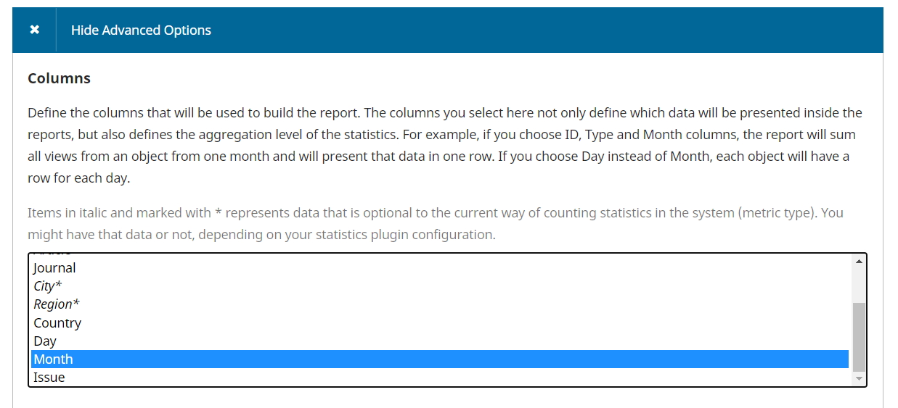

* We want only a very light filtering of our data. Select submission files, then select the galley formats you wish to include in your report. This example selects only PDF, but you could select PDF and HTML if your journal also offers full-text HTML article downloads. Use Ctrl+Click or Command+Click to select multiple types. Under Object ID, enter the object ID of the issue that you’re interested in, which will be located in the issue’s URL. For example, an issue with the URL publicknowledgeproject.org/journal/index.php/journal/issue/view/**24** has the object ID 24.

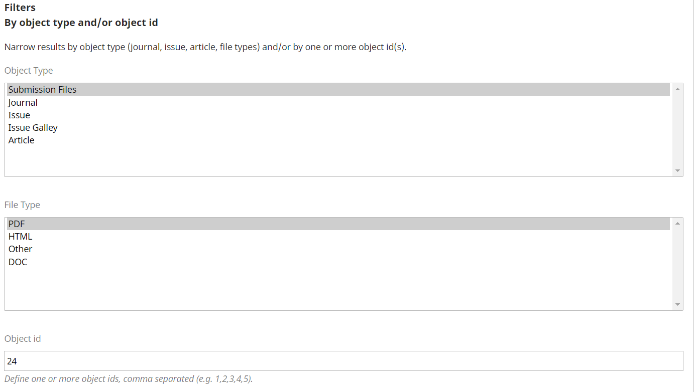

* Ignore the “By geo location” and “Order by” options, and click “Generate custom report.”
* You’ll end up with a very simple monthly report of the galley downloads for the one issue of interest for your journal.

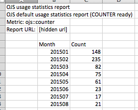

* Save the URL at the bottom of the page for your records!

#### Example report: What are the most downloaded articles over the last 5 years?

This report will present a list of article titles (and the issues they come from) ordered by descending download counts.

* Select “Article file downloads” from the dropdown box.
* Uncheck all boxes under “Aggregate stats by.”
* Select the “Month” radio button and enter a date range.

* Select only “Article” and “Issue” under Columns. We’ll be narrowing down the type at a later point in the query.

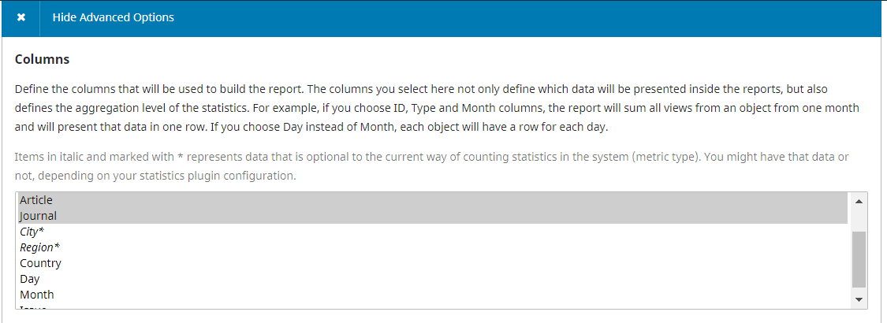

* Select “Submission Files” under object type and select all galley types you wish to include in the download count. 

* Ignore “geo location” (not shown here).
* “Order by” will arrange your articles in descending order by number of downloads. To achieve this, select “Count” in the first drop down box, and the select “Descending.”

* The resulting report will appear as follows (truncated):

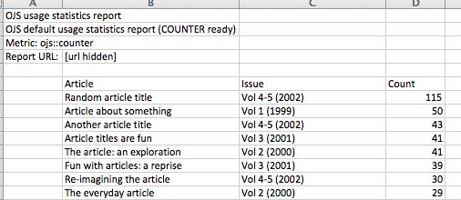

* Save your URL at the bottom of the page!

#### Example: What’s our most popular issue?

This query displays a count of full text downloads for each journal issue and orders the results from highest to lowest.

* Select “Article file downloads” from the dropdown box.
* Uncheck all boxes under “Aggregate stats by.”
* Select the “Month” radio button and enter a date range.

* Under columns, click on “Issue.”

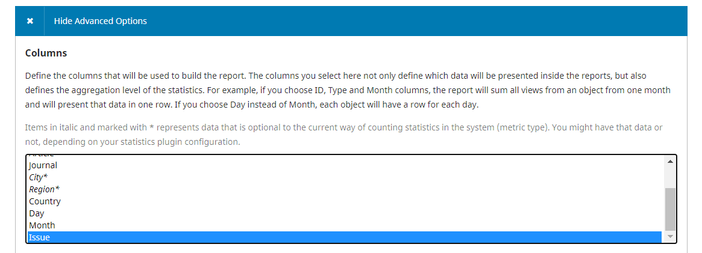

* Under “Filters”, select “Submission Files” under Object Type, and select the galley file type(s) used by your journal (use Ctrl+Click or Command+Click to select multiple types).

* Ignore “geo location” (not shown here).
* “Order by” will arrange your articles in descending order by number of downloads. To achieve this, select “Count” in the first drop down box, and the select “Descending.”

* Run your report. Here is what you’ll get:

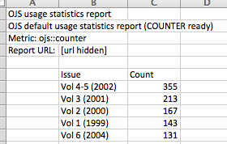

* Don’t forget to save your URL to run at a later date.

#### Example: What countries are downloading our articles (for a specific date interval)?

This query will display aggregate counts for fulltext downloads by country in descending order. Note that one will need to specify a date range.

* Select “Article file downloads” from the dropdown box.
* Uncheck all boxes under “Aggregate stats by.”
* Select the “Month” radio button and enter a date range.

* Select only “Journal” and “Country” under Columns. You can use Ctrl+Click or Command+Click to select multiple items. We’ll be narrowing down the type at a later point in the query.

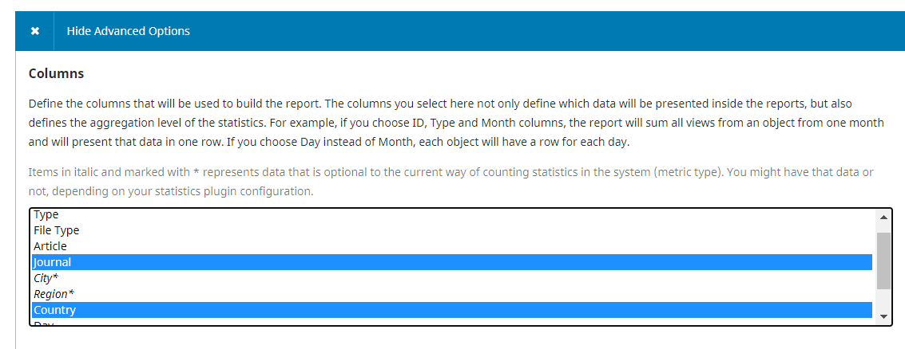

* Under “Filters”, select “Submission Files” under Object Type, and select the galley file type(s) used by your journal (use Ctrl+Click or Command+Click to select multiple types).

* “Order by” will arrange your articles in descending order by number of downloads. To achieve this, select “Count” in the first drop down box, and the select “Descending.”

* Run the report.
* Don’t forget to save your URL to run at a later date.

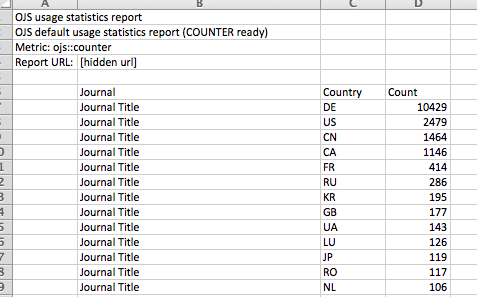

### Display Usage Statistics for Readers

In OJS 3 you can display an article’s usage statistics for the current year as a graph on the article landing page by using the Usage Statistics Plugin, as seen in this image.

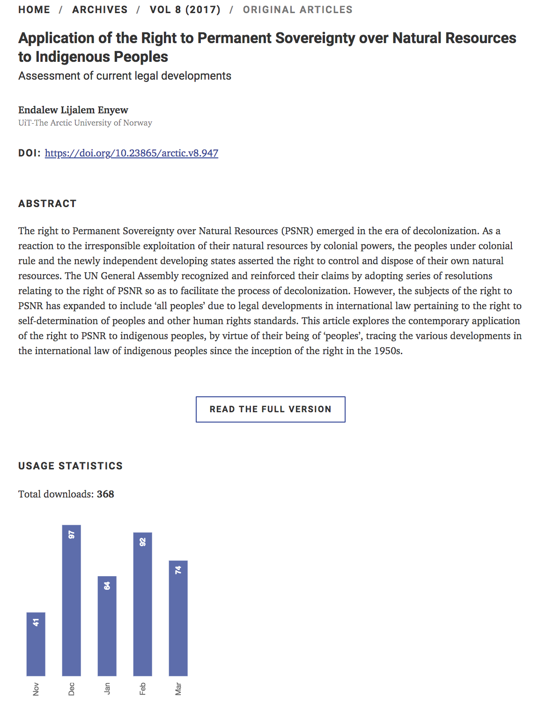

To enable the Usage Statistics Plugin:

1. Go to Settings &gt; Website &gt; Plugins.
2. Under Generic Plugins, find the **Usage Statistics Plugin**.
3. Check the box to the right of the plugin description.

To configure the Usage Statistics Plugin:

1. Go to Settings &gt; Website &gt; Plugins.
2. Under Generic Plugins, find the **Usage Statistics Plugin**.
3. Click the blue arrow to the left of the plugin name to make links appear below the plugin.
4. Click **Settings**.
5. Scroll to the bottom of the pop-up box that opens to the section **Statistics Display Options**.
6. Check the box beside **Display submission statistics chart for reader**.
7. Below that you can select whether you would like to display the statistics as a bar or line graph and the maximum number of months to display usage for.
8. Click **Save**.

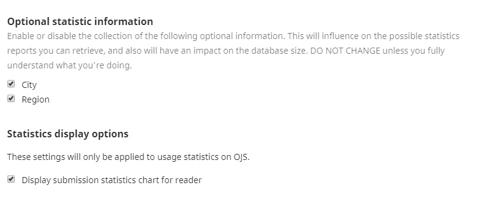

Please note the following:

* Usage statistics can only be displayed for the current year. The plugin is reset at the beginning of each year.
* The statistics being displayed indicate the number of times an article was downloaded.
