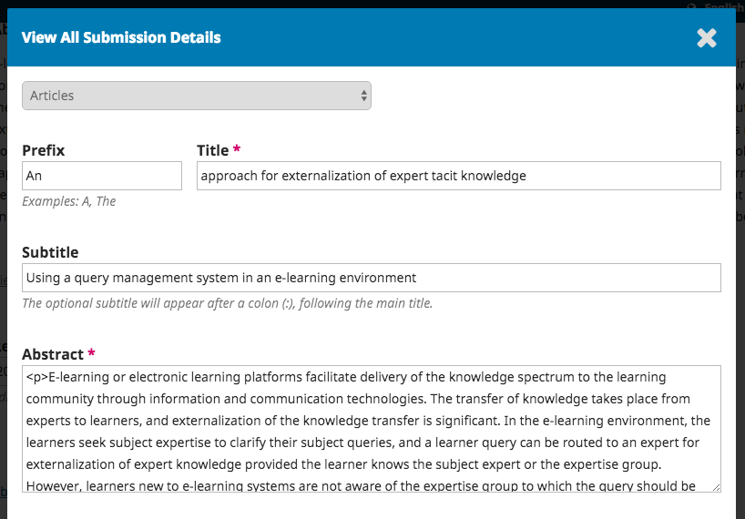
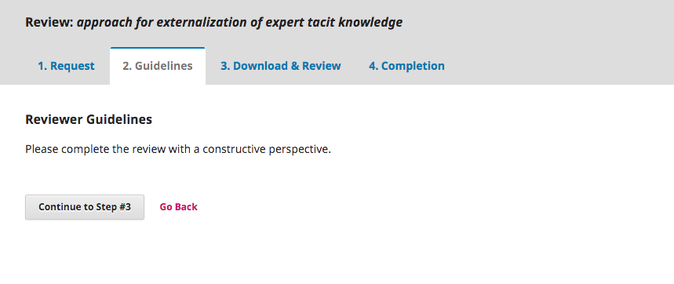

# Avaliando


Este vídeo da PKP School explica como avaliar um artigo no OJS. Para assistir a outros vídeos desta série, visite o [canal do PKP no YouTube](https://www.youtube.com/playlist?list=PLg358gdRUrDUKJbWtr4bgy133_jwoiqoF).

Como avaliador, você ficará sabendo da solicitação de avaliação por e-mail ou verificando seu painel:

Na lista "Minhas Submissões Designadas", encontram-se o título e o link "Avaliação". Observe a falta de qualquer informação sobre o autor neste processo de avaliação por pares do Avaliador Anônimo/Autor Anônimo.

Selecione o link "Avaliação" e você será direcionado à primeira etapa de avaliação no registro de envio, que é muito mais limitado do que a visão do Editor e não contém informações do Autor.

Essa primeira etapa é constituída das seguintes seções:

**Solicitação de Avaliação**: fornece algum texto convidando você a atuar como um avaliador.

**Título do artigo**: mostra o título do artigo.

**Resumo**: apresenta o texto do resumo.

Mais abaixo na tela, você encontrará informações adicionais.

Por meio do link **Ver todos os detalhes da submissão**, uma janela com informações adicionais é aberta. Nela, constam todos os metadados que não são do Autor:

Observe que nenhum desses campos pode ser editado pelo Avaliador e são fornecidos apenas para ajudá-lo a realizar uma avaliação completa.

Feche esta janela e mova mais para baixo a tela. A partir daqui, você pode ver o cronograma de avaliação, incluindo todas as datas de vencimento relevantes.

A partir daqui, você pode recusar ou aceitar a avaliação. Se recusar, será excluído do processo. Se aceitar, passará à etapa 2 de avaliação, na qual poderá ler todas as diretrizes para avaliadores fornecidas pela revista.

Clique em **Continuar** para ir à etapa 3. Nessa etapa, você pode baixar uma cópia dos arquivos de avaliação e inserir seus comentários da avaliação. A primeira janela é para comentários ao Editor e ao Autor; a segunda janela é apenas para o Editor.

Depois de ler o artigo e adicionar seus comentários, role a página para baixo para, opcionalmente, transferir uma cópia marcada do arquivo de avaliação (lembre-se de retirar qualquer identificação pessoal do arquivo antes de carregá-lo).

Em seguida, você deve fazer suas recomendações usando o menu suspenso.

Suas escolhas incluem:

**Aceitar**: o manuscrito está pronto para ir à edição.

**Correções obrigatórias**: o texto requer pequenas alterações que podem ser revisadas e aceitas pelo editor.

**Submeter novamente para Avaliação**: requer grandes alterações e outra etapa de avaliação por pares.

**Submeter a outra revista**: o manuscrito não parece se ajustar ao foco e escopo do periódico.

**Rejeitar**: o manuscrito tem muitos pontos fracos para ser aceito.

**Ver comentários**: se nenhuma das recomendações acima fizerem sentido, é possível deixar um comentário para o editor, detalhando suas preocupações.

Por fim, clique no botão "Enviar Avaliação" para concluir a tarefa. Você será solicitado a confirmar.

Clique em OK. Você será direcionado para a tela de confirmação final, que agradecerá pelo seu trabalho

É isso! A avaliação está completa.
